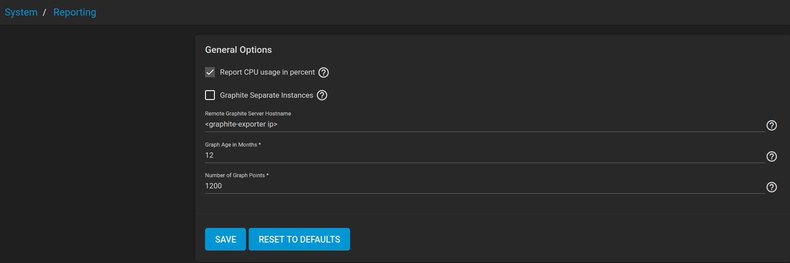
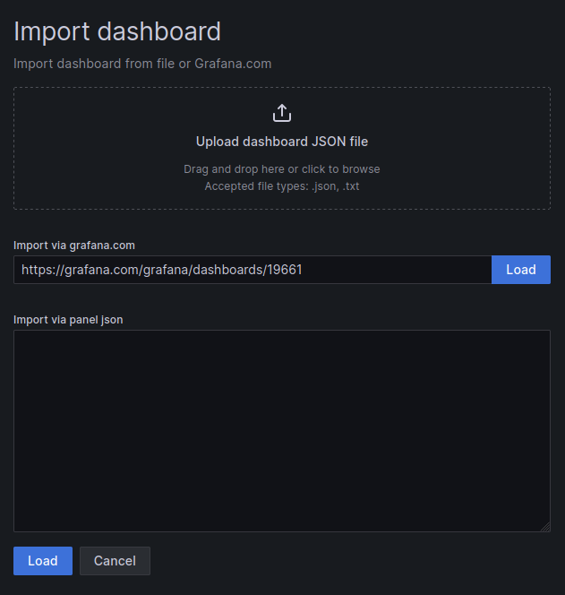
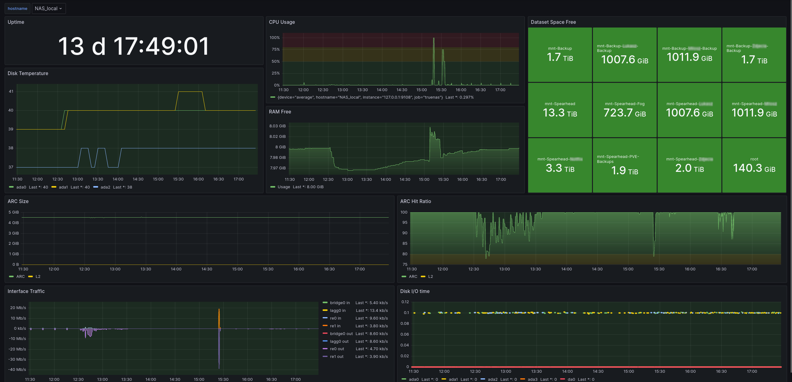

# truenas-grafana
A simple and clean TrueNAS Core/Scale grafana dashboard based on prometheus

## Installation

1. Set up [graphite-exporter](https://github.com/prometheus/graphite_exporter) with the included [mappings](graphite-mappings.conf)

2. Configure TrueNAS for pushing metrics to the graphite-exporter endpoint
<br>



3. Add a prometheus scrape task

```
- job_name: truenas
  scrape_interval: 15s
  metrics_path: /metrics
  static_configs:
  - targets:
     - <graphite-exporter ip>:9108
```

4. Import the dashboard
<br>



## Screenshots
<br>



